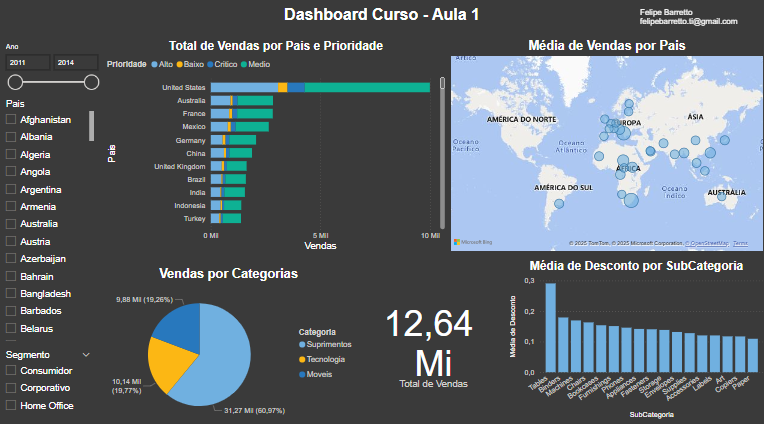

# EN #
# Sales Analysis Dashboard - Power BI 📊

This project was developed as part of a Power BI course, focusing on the creation of interactive dashboards and data visualizations.

## 📷 Screenshot 

## 📝 About the Project
This dashboard provides a sales analysis with:
- Top-selling products overview;
- Top-buyers overview;
- Interactive filters by region and product category.

## 🛠️ Tools & Technologies
- Power BI  

## 📂 How to Use
1. Download the `.pbix` file from this repository;
2. Open it in Power BI Desktop to explore the report.

# PT-BR #
# Dashboard de Análise de Vendas - Power BI 📊

Este projeto foi desenvolvido como parte do curso de Power BI, com foco na criação de dashboards interativos e visualizações de dados.

## 📝 Sobre o Projeto
Dashboard de vendas com:
- Top produtos mais vendidos;
- Top compradores;
- Filtros interativos por região e categoria.

## 🛠️ Tecnologias
- Power BI

## 📂 Como visualizar
1. Faça o download do arquivo `.pbix`;
2. Abra no Power BI Desktop.
   

## 📬 Contact

📧 Email: felipebarretto.ti@gmail.com 🔗 [LinkedIn](https://www.linkedin.com/in/felipe-barretto-990054304/)
